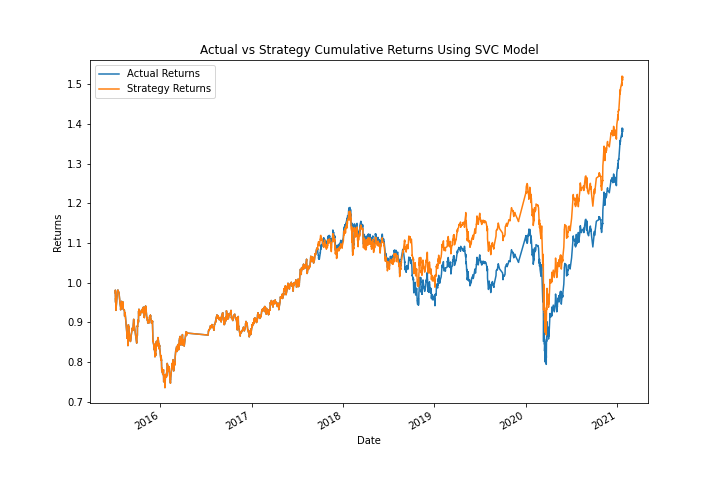

# Module_14_Challenge
Building upon a previously created algorithmic trading system, we will seek to improve the existing system by enhancing the existing trading signals with machine learning algorithms that can adapt to new data.

# Technologies
The project uses the following libraries and dependencies:
* pandas - For use of pandas functions
* numpy - For arrays
* pathlib - To interact with saved csv
* sklearn - Machine learning library

# Summary
After having run the existing algorithmic trading system, we began by initiating the SVC model and using the scaled training features to fit the data to the model. Then, we used the scaled testing features to make our model predictions. We evaluated these predictions by running a classification report, which in the case of our predicition set gave us an accuracy score of .55. By creating a new dataframe, we could examine how the SVC model performed as compared with the actual data collected from the existing/original system. Below, we can see that while the model closely follows the 'Actual Returns' data, it produces slightly better returns--shown by 'Strategic Returns'--given enough time.

We then examined how adjusting the size of the dataset effected the trading outcome, first by decreasing the dataset size and then by increasing it relative to the original model. As can be seen below, by decreasing the dataset we consistantly perform better than the actual returns, but at the expense of a decreased return overall. 

By increasing the dataset size (see below), we end up with a higher overall return, but often find that the actual returns outperform our model throughout. 

We then examined how adjusting the SMA features effected the trading outcome. We first increased the short term window, and then tried increasing the long term window. In both cases, we find that the strategy underperforms the original trading system. 

We ended by testing an alternative machine learning model--in this case a logistical regression model--to see if the overall accuracy of the model could be further improved (as compared with the SVC model). Unfortunately, the model underperformed our SVC model with an accuracy score of .52, and a lower overall return. See below for the return data of the logistic regression model. 

Overall, the SVC model with decreased dataset size delivered consistent returns that exceeded the original algorithmic trading system, and would be the suggested model should a new system be implemented. 